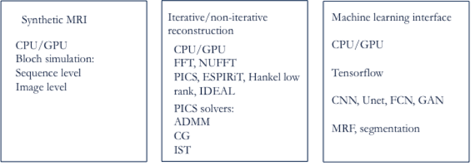
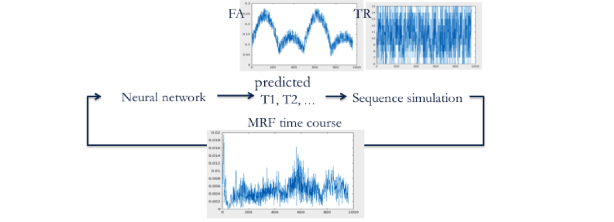
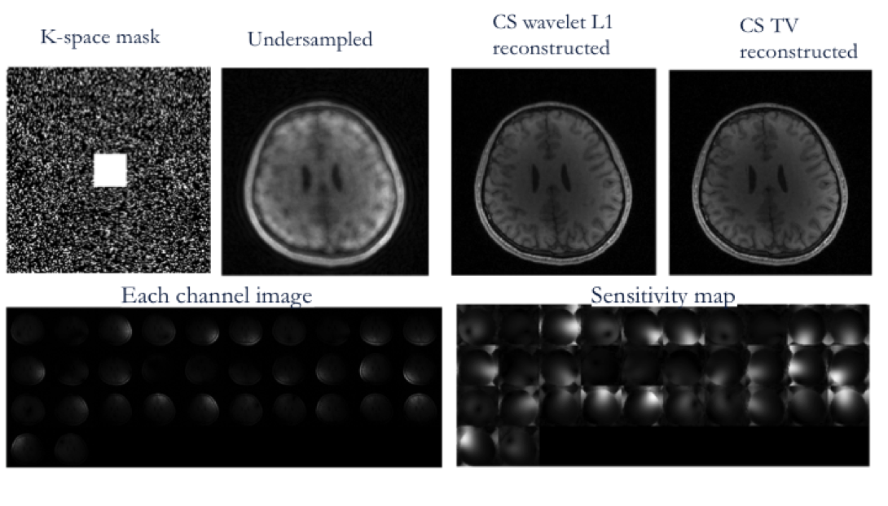
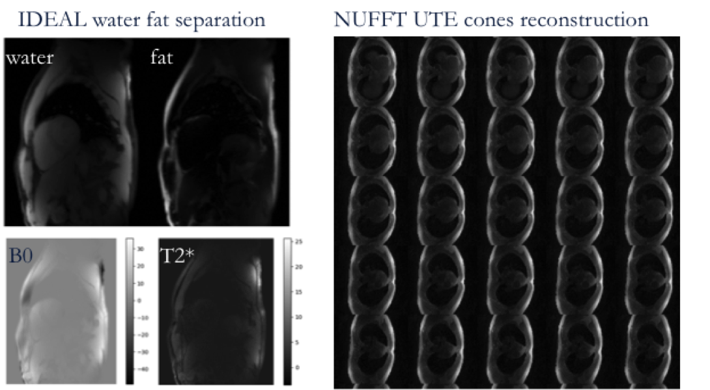
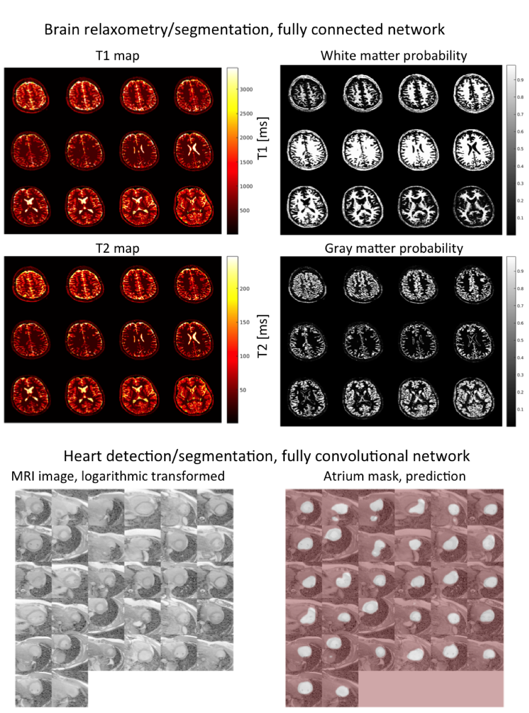

## mripy
A python based MRI reconstruction toolbox with compressed sensing, parallel imaging and machine-learning functions
## Key functions
* "bloch_sim/"      contains functions for MRI sequence simulation, these functions are designed for MR fingerprinting experiment
* "fft/"            this is a wrap of FFT functions, i.e. cuFFT, FFTW, and NUFFT, implemented for both CPU and GPU
* "pics/"           contains optimization algorithms, such as ADMM, conjugate gradient, gradient descent, for MRI compressed sensing and parallel imaging reconstructions, as well as operators such as total variation, Hankel matrix, coil sensitivity
* "neural_network/" contains a wrap of tensorflow functions for creating and testing neural_network, and zoo/ contains examples for full connection net, CNN, Unet, and FCN.  
* "test/"           contains testing code for above functions and something I am working on right now, e.g. MRI PICS reconstruction, IDEAL + CS reconstruction, FC or CNN for MRF quantification, Unet for creating mask on medical images

## Examples
* Figure 1 MRIPY toolbox contains three major blocks: synthetic MRI, iterative/non-iterative reconstruction, and machine learning interface.
<table>
    <tr>
        <td>
            
        </td>
    </tr>
</table>
* Figure 2 An illustration of MR fingerprinting (MRF) simulation in conjunction with a trained neural network for MRF time course parameter prediction. Random flip angle (FA) and repetition time (TR) were shown on top.
<table>
    <tr>
        <td>
            
        </td>
    </tr>
</table>
* Figure 3 An example of parallel imaging (PI) and compressed sensing (CS) reconstruction (PICS) with alterative direction multiplier method (ADMM) and wavelet L1 or total variation minimization regularization (TV).  Raw MRI data is from website (http://people.eecs.berkeley.edu/~mlustig/CS.html).
<table>
    <tr>
        <td>
            
        </td>
    </tr>
</table>
* Figure 4 Examples of MRI reconstruction tasks. (left) IDEAL water and fat separation from a three TEs images, raw image from website (https://www.ismrm.org/workshops/FatWater12/data.htm). (right) NUFFT based reconstruction for UTE cones image.
<table>
    <tr>
        <td>
            
        </td>
    </tr>
</table>
* Figure 5 (top) Whole brain segmentation/relaxometry were the direct output of neural network trained with the synthetic MRI block in Fig. 1. (bottom) Another more complex task that is detection/segmentation of atrium from MRI image. The MRI data is from Dr. Yan Wang.  A fully convolutional network performed the segmentation as an exampled provide in MRIPY.
<table>
    <tr>
        <td>
            
        </td>
    </tr>
</table>
